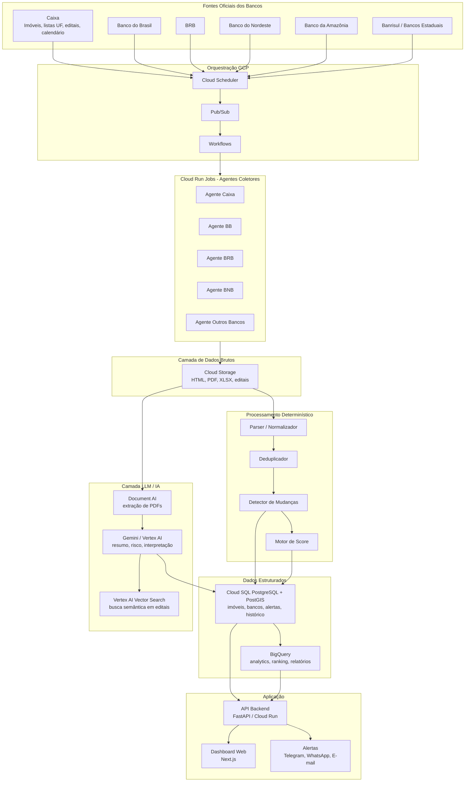
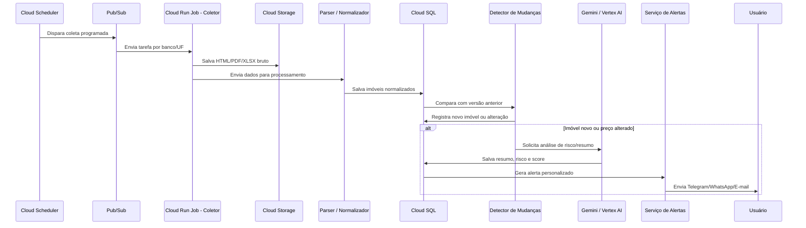
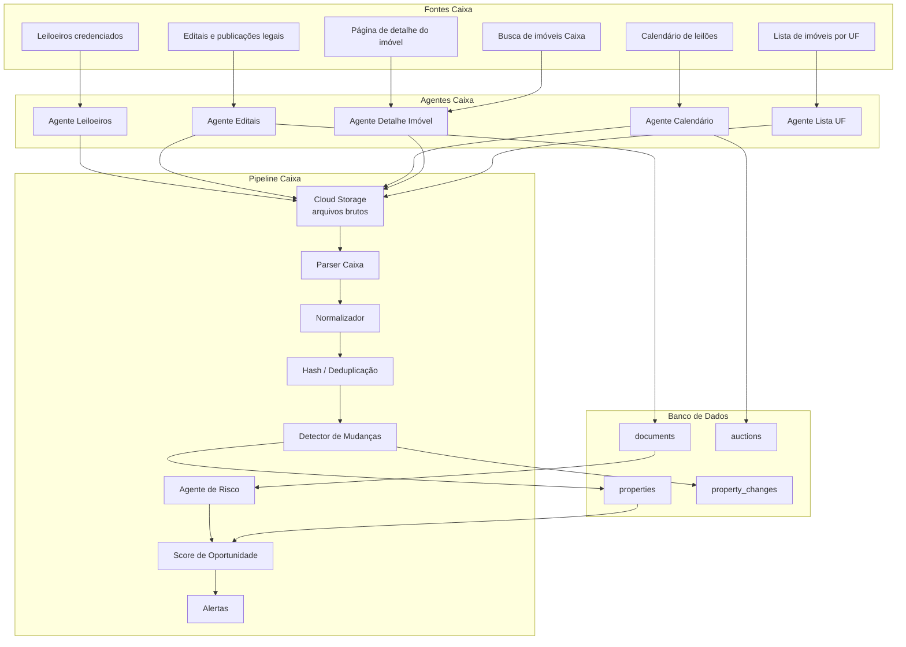
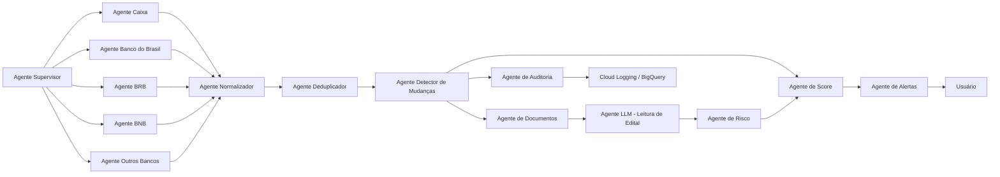
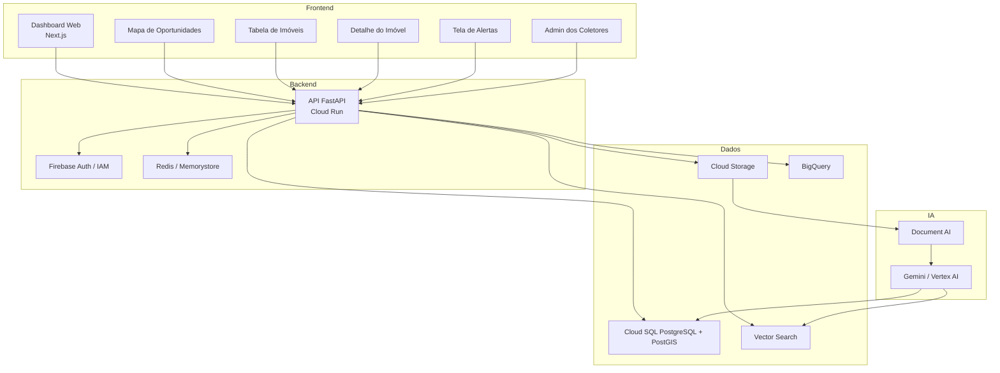
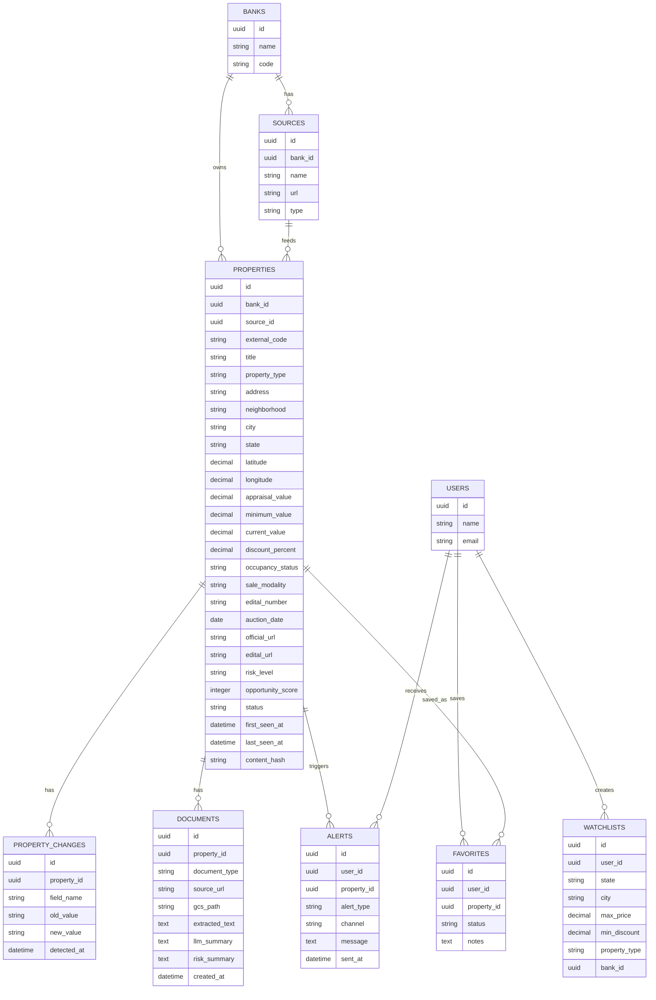
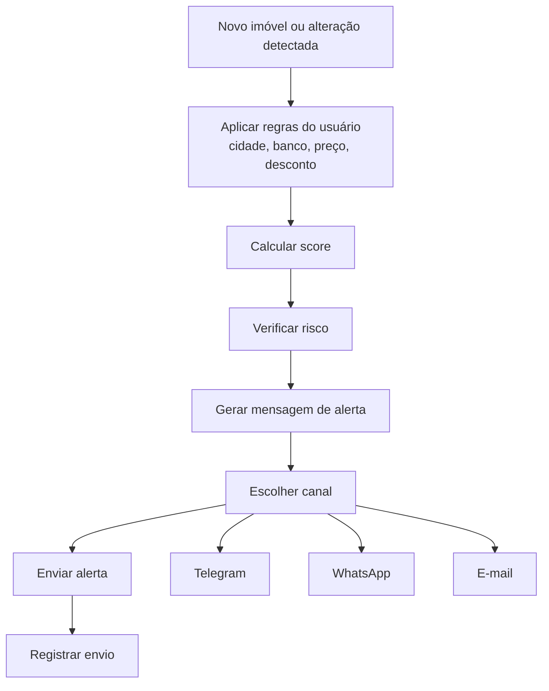
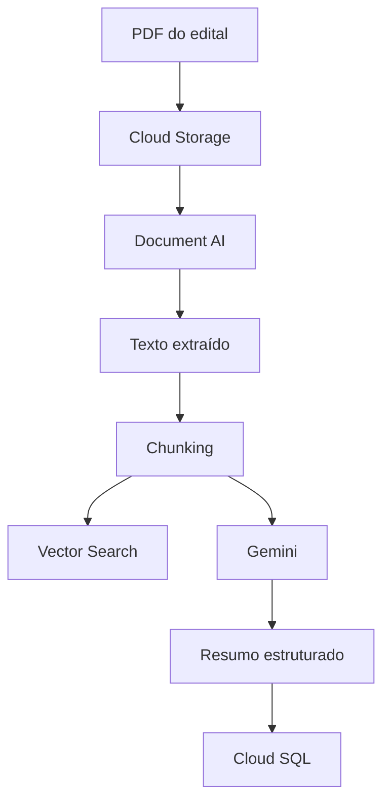

# Aplicação Leilões Imóveis Públicos

**User:** Anonymous  
**Created:** 5/26/2026 15:09:31  
**Updated:** 5/26/2026 15:46:48  
**Exported:** 5/26/2026 15:47:40  
**Link:** [https://chatgpt.com/c/6a15e186-9928-8325-bf4d-d8d5a02f50be](https://chatgpt.com/c/6a15e186-9928-8325-bf4d-d8d5a02f50be)  

## Prompt:
26/05/2026, 15:10:39

PRECISO DE UMA APLICACAO PARA MONITORAR OS LEILOES DE IMOVEIS NOS BANCOS PUBLICOS .

## Response:
26/05/2026, 15:09:31

> **Procurando sites de leilões de imóveis de bancos públicos**
>
> [Venda de Imóveis CAIXA](https://www.caixa.gov.br/voce/habitacao/imoveis-venda/Paginas/default.aspx)
> [Venda de Imóveis BB: leilão e venda direta - Portal BB](https://www.bb.com.br/site/compras-contratacao-e-venda-de-imoveis/venda-de-imoveis/)
> [Bens à Venda – oportunidades disponíveis – Banco do Nordeste - Portal Banco do Nordeste](https://www.bnb.gov.br/acesso-a-informacao/licitacoes-e-contratos/bens-a-venda)
> [Leilões de Imóveis | Banco da Amazônia](https://www.bancoamazonia.com.br/o-banco/licitacoes/leiloes-de-imoveis)
> [Caixa Imobiliário - Venda, Arrendamento e Leilões de Imóveis do ...](https://www.caixaimobiliario.pt/)
> [Seu Imóvel BB :: Seu Imóvel BB](https://seuimovelbb.com.br/)
> [Leilão de BANCO DO NORDESTE](https://www.chuileiloes.com.br/evento/banco-do-nordeste-683233?orderBy=lotNumber%3Aasc%3BsubLotNumber%3Aasc&pageNumber=1&pageSize=30&preOrderBy=orderByFirstOpenedOffers)
> [Leilões de Imóveis](https://www.bancodamazonia.com.br/licitacao/leiloes-de-imoveis)
> [Alguém aqui já comprou pelo leilões BR?](https://www.reddit.com/r/brasil/comments/1o5xopi)
>
> **Analisando requisitos e informações sobre a Caixa**
>
> [Venda de Imóveis BB: leilão e venda direta - Portal BB](https://www.bb.com.br/site/compras-contratacao-e-venda-de-imoveis/venda-de-imoveis/)
> [Bens à Venda – oportunidades disponíveis – Banco do Nordeste - Portal Banco do Nordeste](https://www.bnb.gov.br/acesso-a-informacao/licitacoes-e-contratos/bens-a-venda)
> [Leilões de Imóveis | Banco da Amazônia](https://www.bancoamazonia.com.br/o-banco/licitacoes/leiloes-de-imoveis)
>
> **Procurando imóveis à venda em leilão de bancos**
>
> [Bens à venda | Banrisul](https://www.banrisul.com.br/bob/site/link/bens-a-venda.html)
> [Imóveis BRB - Banco BRB](https://novo.brb.com.br/imoveis-brb/)
> [Venda de Imóveis BB: leilão e venda direta - Portal BB](https://www.bb.com.br/site/compras-contratacao-e-venda-de-imoveis/venda-de-imoveis/)
> [Feirão BRB | Encontre ótimas oportunidades](https://feiraobrb.com.br/)
> [Leilão de imóveis do Banco do Brasil. Apartamentos, casas, terrenos ...](https://www.leilaoimovel.com.br/banco_leilao_de_imoveis/banco-do-brasil)
> [Banrisul disponibiliza página dedicada à venda de imóveis e outros ...](https://www.tuaradio.com.br/noticias/geral/29-04-2026/banrisul-disponibiliza-pagina-dedicada-a-venda-de-imoveis-e-outros-bens)
> [Imóveis de Leilão por Bancos e Leiloeiros | Monitor Leilão](https://www.monitorleilao.com.br/listagem/bancos-e-leiloeiros)
> [Mônica Bergamo: Casa de Edemar Cid Ferreira, do falido Banco Santos, é vendida por R$ 23,3 mi](https://www.reddit.com/r/brasilnoticias/comments/bs8x6t)
>
> **Elaborando uma proposta técnica para o usuário**
>
> O usuário parece querer ajuda na especificação de uma aplicação. Posso fornecer uma proposta técnica, incluindo módulos, funcionalidades como monitoramento, normalização e alertas, com MVP, tech stack, campos de dados e tabela de banco. Vou garantir que qualquer dado da internet seja citado corretamente e alertar sobre riscos, como LGPD e scraping.
>
> **Elaborando escopo técnico e fases de desenvolvimento**
>
> Os documentos oficiais incluem fontes como Caixa, BB, BNB, BASA, Banrisul e BRB. Posso apresentar o projeto em quatro fases, sugerindo um escopo técnico com frontend web, backend em Node/Python, Postgres, scraping/API, notificações, mapas. Também posso incluir um MVP em 30 dias e priorizar a Fase 1, sem estimativa para o futuro.
>
> Pensado para 21s

Posso te ajudar a transformar isso em um produto bem definido: fontes de dados, alertas, filtros, painel e um MVP viável. Vou considerar Brasil e bancos públicos como Caixa, Banco do Brasil e outros bancos estatais/regionais, e verificar as fontes atuais antes de sugerir a arquitetura.

Entendi. Você precisa de uma **aplicação para monitorar leilões e vendas de imóveis de bancos públicos no Brasil**, com alertas e filtros para não perder oportunidades.

A base inicial deve monitorar fontes oficiais como:

- **Caixa** - página oficial de venda de imóveis, com pesquisa e documentos publicados. ([Caixa Econômica Federal](https://www.caixa.gov.br/voce/habitacao/imoveis-venda/Paginas/default.aspx?utm_source=chatgpt.com))  
- **Banco do Brasil** - plataforma oficial de venda de imóveis, incluindo leilão e venda direta. ([BB](https://www.bb.com.br/site/compras-contratacao-e-venda-de-imoveis/venda-de-imoveis/?utm_source=chatgpt.com))  
- **Banco do Nordeste** - seção “Bens à Venda”, com relação de bens em PDF, atualizada em 23/03/2026. ([Banco do Nordeste](https://www.bnb.gov.br/acesso-a-informacao/licitacoes-e-contratos/bens-a-venda))  
- **Banco da Amazônia** - editais de venda de bens penhorados, leilão/praça pública e venda direta. ([Banco da Amazonia](https://www.bancoamazonia.com.br/o-banco/licitacoes/leiloes-de-imoveis))  
- **Banrisul** - página oficial de bens à venda, incluindo venda direta, licitação e leilão. ([Banrisul](https://www.banrisul.com.br/bob/site/link/bens-a-venda.html?utm_source=chatgpt.com))  
- **BRB** - página de imóveis disponíveis e envio de proposta. ([Banco BRB](https://novo.brb.com.br/imoveis-brb/?utm_source=chatgpt.com))  

## Aplicação sugerida

Nome provisório: **Monitor Leilões Públicos**

### Funções principais

1. **Coleta automática**
   - Caixa
   - Banco do Brasil
   - Banco do Nordeste
   - Banco da Amazônia
   - Banrisul
   - BRB
   - Futuramente: bancos estaduais, prefeituras, tribunais e leiloeiros oficiais.

2. **Painel de oportunidades**
   - Banco de origem
   - Cidade/UF
   - Bairro
   - Tipo: casa, apartamento, terreno, comercial, rural
   - Modalidade: leilão, venda direta, licitação, proposta
   - Valor de avaliação
   - Valor mínimo/lance inicial
   - Percentual de desconto
   - Data do leilão
   - Status: novo, atualizado, encerrado, vendido
   - Link oficial
   - Edital/documentos

3. **Alertas inteligentes**
   - E-mail
   - WhatsApp ou Telegram
   - Push no celular
   - Alertas por cidade, bairro, faixa de preço, banco, desconto mínimo e tipo de imóvel.

4. **Análise de oportunidade**
   - Cálculo automático de desconto.
   - Histórico de preço do imóvel.
   - Comparação com preço médio de mercado, usando integrações futuras com Zap, OLX, QuintoAndar ou base própria.
   - Marcação de risco: imóvel ocupado, pendência judicial, ausência de matrícula, edital incompleto.

5. **Favoritos e acompanhamento**
   - Salvar imóveis favoritos.
   - Criar notas.
   - Marcar como “analisar”, “visitar”, “descartar”, “dar lance”.
   - Receber alerta se o edital mudar ou o preço baixar.

6. **Verificação de segurança**
   - Mostrar apenas links oficiais ou leiloeiros identificados.
   - Destacar quando o imóvel vem de parceiro/leiloeiro externo.
   - Avisar para conferir edital, matrícula, ocupação, débitos e leiloeiro oficial antes de pagar qualquer valor.

## Estrutura técnica recomendada

### Frontend
- React / Next.js
- Painel web responsivo
- PWA para usar como aplicativo no celular

### Backend
- Python com FastAPI ou Node.js com NestJS
- Robôs de coleta por banco
- Fila de processamento com Redis
- Agendador automático para checar novidades várias vezes ao dia

### Banco de dados
- PostgreSQL
- PostGIS para busca por mapa e distância
- Tabelas principais:
  - `properties`
  - `auctions`
  - `banks`
  - `documents`
  - `price_history`
  - `alerts`
  - `users`
  - `favorites`

### Coleta de dados
- Preferir arquivos oficiais, PDFs, páginas públicas e endpoints públicos quando existirem.
- Evitar automações agressivas que possam violar termos de uso.
- Guardar sempre a fonte, data de coleta e link original.

## Campos mínimos de cada imóvel

```text
id
banco
titulo
tipo_imovel
endereco
bairro
cidade
uf
valor_avaliacao
valor_minimo
desconto_percentual
modalidade
data_leilao
status
ocupado
link_oficial
link_edital
data_coleta
hash_conteudo
```

## MVP recomendado

A primeira versão deve focar em:

1. **Caixa + Banco do Brasil**
2. Busca por cidade/UF
3. Filtro por preço e desconto
4. Alerta por e-mail/Telegram
5. Histórico de alterações
6. Página de detalhe do imóvel com link oficial e edital

Depois entram Banco do Nordeste, Banco da Amazônia, Banrisul e BRB.

## Diferencial importante

O grande valor da aplicação não é só listar imóveis. É avisar rápido quando aparece uma oportunidade boa.

Exemplo de alerta:

> Novo imóvel encontrado: Apartamento em Goiânia/GO, Caixa, R$ 180.000, desconto estimado de 42%, venda direta, edital disponível.

Também recomendo incluir um **score de oportunidade**, por exemplo:

```text
Score = desconto + liquidez da cidade + preço por m² + prazo até leilão - risco de ocupação - pendências conhecidas
```

## Próximo passo

O caminho mais direto é montar um **documento de especificação do MVP**, com telas, banco de dados, regras de coleta e backlog técnico para desenvolvimento.

---

**Sources:**

- [Venda de Imóveis CAIXA](https://www.caixa.gov.br/voce/habitacao/imoveis-venda/Paginas/default.aspx?utm_source=chatgpt.com)
- [Venda de Imóveis BB: leilão e venda direta - Portal BB](https://www.bb.com.br/site/compras-contratacao-e-venda-de-imoveis/venda-de-imoveis/?utm_source=chatgpt.com)
- [Bens à Venda – oportunidades disponíveis – Banco do Nordeste - Portal Banco do Nordeste](https://www.bnb.gov.br/acesso-a-informacao/licitacoes-e-contratos/bens-a-venda)
- [Leilões de Imóveis | Banco da Amazônia](https://www.bancoamazonia.com.br/o-banco/licitacoes/leiloes-de-imoveis)
- [Bens à venda | Banrisul](https://www.banrisul.com.br/bob/site/link/bens-a-venda.html?utm_source=chatgpt.com)
- [Imóveis BRB - Banco BRB](https://novo.brb.com.br/imoveis-brb/?utm_source=chatgpt.com)

## Prompt:
26/05/2026, 15:15:13

> BRB

COMO PODERIA FAZER USANDO  MULT AGENTES

## Response:
26/05/2026, 15:14:05

> **Pesquisando BRB imóveis e plataformas atualizadas**
>
> [Imóveis BRB - Banco BRB](https://novo.brb.com.br/imoveis-brb/)
> [Feirão BRB | Encontre ótimas oportunidades](https://feiraobrb.com.br/)
> [Leilão de imóveis do Banco BRB. Apartamentos, casas, terrenos ...](https://www.leilaoimovel.com.br/banco_leilao_de_imoveis/banco-brb)
> [Casas em Leilão — BANCO DE BRASÍLIA (BRB) | Monitor Leilão](https://www.monitorleilao.com.br/listagem/bancos-e-leiloeiros/banco-de-brasilia-brb/casas)
> [Valores de imóveis em leilão](https://www.reddit.com/r/investimentos/comments/1fhk04l)
>
> **Descrevendo estrutura sugerida para agentes múltiplos BRB**
>
> Preciso mencionar que a página oficial da BRB tem detalhes sobre propostas, FAQs, como o julgamento de terça a domingo e questões relacionadas. O uso de agentes LLM pode ser específico para sumarização e extração de risco. Também é essencial referir a arquitetura sugerida com agentes como Orquestrador e Parcer, e citar páginas relevantes como fonte.
>
> **Descrevendo arquitetura multi-agentes para scraping BRB**
>
> [Imóveis BRB - Banco BRB](https://novo.brb.com.br/imoveis-brb/)
> [Feirão BRB | Encontre ótimas oportunidades](https://feiraobrb.com.br/)
>
> **Propondo arquitetura para Multi-Agentes BRB e soluções tecnológicas**
>
> A arquitetura deve focar em "agentes especialistas" com responsabilidades definidas. A lista oficial da BRB tem filtros como tipo, preço, quartos e estados, e o Feirão BRB envolve venda direta e leilão. Vou sugerir tecnologias como CrewAI ou LangGraph, mas preciso garantir que as fontes sejam citadas corretamente e que as recomendações sejam atualizadas.
>
> **Pesquisando sobre LangGraph e CrewAI para agentes**
>
> [LangGraph: Agent Orchestration Framework for Reliable AI Agents](https://www.langchain.com/langgraph)
> [CrewAI Documentation - CrewAI](https://docs.crewai.com/)
> [LangGraph Framework Documentation | langchain-ai/docs | DeepWiki](https://deepwiki.com/langchain-ai/docs/2.2-langgraph-framework-documentation)
> [GitHub - crewAIInc/crewAI: Framework for orchestrating role-playing ...](https://github.com/crewAIInc/crewAI)
> [Mastering Multi-Agent Systems with CrewAI: A Practical Guide](https://dev.to/ismail_zamareh_d099419122bc4f/mastering-multi-agent-systems-with-crewai-a-practical-guide-23f0)
> [From Virtual Agents to Robot Teams: A Multi-Robot Framework Evaluation in High-Stakes Healthcare Context](https://arxiv.org/abs/2506.03546)
> [Fully local multi-agent systems with LangGraph - YouTube](https://www.youtube.com/watch?v=4oC1ZKa9-Hs)
> [Managing shared state in LangGraph multi-agent system](https://www.reddit.com/r/LangGraph/comments/1n867pe)
>
> **Propondo arquitetura multi-agentes para BRB com referências**
>
> A arquitetura recomendada é híbrida, com agentes especializados. Deve evitar que LLMs cliquem ou comprem; eles são usados apenas para interpretar documentos. É importante citar dois sites principais da BRB: novo.brb.com.br (para listagens) e feiraobrb.com (para filtros como tipo, preço e estado). LangGraph é útil para workflows com humanos.
>
> Pensado para 25s

Vou estruturar isso como uma arquitetura de multiagentes focada no BRB: agentes de coleta, validação, enriquecimento, alerta e auditoria, com um fluxo simples para começar como MVP.

Sim. Para o **BRB**, eu faria uma arquitetura **multiagente híbrida**: alguns agentes são robôs determinísticos de coleta e validação; outros usam IA para interpretar edital, classificar risco e gerar alertas.

O BRB tem duas fontes importantes para monitorar: a página oficial de **Imóveis BRB**, que mostra imóveis disponíveis, filtros por tipo, preço, ocupação e estado, além do fluxo de proposta; e o **Feirão BRB**, operado pela Resale, onde aparecem imóveis do BRB em venda direta e leilão. ([Banco BRB](https://novo.brb.com.br/imoveis-brb/))

## Arquitetura multiagente para BRB

```text
Scheduler
   ↓
Agente Supervisor
   ↓
┌───────────────────────────────┐
│ Agente Coletor BRB Oficial     │
│ Agente Coletor Feirão BRB      │
│ Agente de Editais/Documentos   │
│ Agente Validador               │
│ Agente Normalizador            │
│ Agente de Risco                │
│ Agente de Score                │
│ Agente de Alertas              │
│ Agente de Auditoria            │
└───────────────────────────────┘
   ↓
Banco de Dados + Painel + Alertas
```

## Papel de cada agente

### 1. Agente Supervisor

É o coordenador. Ele decide quando rodar cada agente, verifica falhas e evita duplicidade.

Exemplo:

```text
A cada 30 minutos:
- Rodar coletor BRB oficial
- Rodar coletor Feirão BRB
- Comparar com imóveis já salvos
- Se houver novo imóvel ou alteração de preço/status, acionar os agentes de análise e alerta
```

Para esse tipo de orquestração, eu usaria **LangGraph** se você quiser controle fino de estado, decisões e fluxo multiagente; a documentação oficial descreve o LangGraph como framework de orquestração para agentes, inclusive workflows multiagente e human-in-the-loop. ([LangChain](https://www.langchain.com/langgraph?utm_source=chatgpt.com))  
Outra opção é **CrewAI**, que é mais direto para definir agentes por papéis, tarefas, memória e guardrails. ([CrewAI Docs](https://docs.crewai.com/?utm_source=chatgpt.com))

---

### 2. Agente Coletor BRB Oficial

Esse agente acessa a listagem oficial do BRB e captura dados como:

```text
codigo
titulo
tipo_imovel
cidade
uf
estado_ocupacao
valor_venda
area
link_detalhes
fonte = "BRB Oficial"
```

Na listagem oficial atual, o BRB expõe filtros como tipo de imóvel, preço, quartos, banheiros, vagas, estado de ocupação e UF; também mostra código, ocupação, título, cidade/UF, tipo, valor de venda e área. ([Banco BRB](https://novo.brb.com.br/imoveis-brb/listing/))

Esse agente deve ser **determinístico**, não IA. Use Python com Playwright ou requests/BeautifulSoup, dependendo de como a página carrega os dados.

---

### 3. Agente Coletor Feirão BRB

Esse é essencial porque o Feirão BRB mostra imóveis do BRB em **venda direta** e **leilão**, incluindo imóveis ocupados/desocupados, descontos, preços e localização. O próprio site informa que a Resale é responsável pelo feiraobrb.com.br e que os imóveis são de propriedade do Banco de Brasília. ([Feirão BRB](https://feiraobrb.com.br/))

Campos que esse agente deve capturar:

```text
modalidade: venda direta ou leilao
preco_original
preco_atual
desconto_percentual
ocupado
cidade
uf
bairro
tipo
quartos
vagas
area
link
```

No Feirão BRB aparecem imóveis em destaque com modalidade, ocupação, desconto, preço, cidade/UF e características como quartos, vagas e área. ([Feirão BRB](https://feiraobrb.com.br/))

---

### 4. Agente de Normalização

Esse agente transforma tudo para um padrão único.

Exemplo:

```json
{
  "banco": "BRB",
  "fonte": "Feirão BRB",
  "codigo": "BRB-2601.12",
  "tipo": "Lote",
  "cidade": "Planaltina de Goiás",
  "uf": "GO",
  "valor_venda": 23000,
  "ocupacao": "Desocupado",
  "modalidade": "Venda direta",
  "link_oficial": "...",
  "hash_conteudo": "abc123"
}
```

A normalização é importante porque o mesmo imóvel pode aparecer em fontes diferentes com textos ligeiramente diferentes.

---

### 5. Agente de Detecção de Mudanças

Esse agente compara o imóvel novo com o imóvel salvo.

Ele detecta:

```text
novo imóvel
preço alterado
desconto alterado
status de ocupação alterado
modalidade alterada
imóvel removido
novo edital
nova data de julgamento/proposta
```

No caso do BRB, vale monitorar também o processo de proposta: a página oficial informa que as propostas devem ser enviadas de terça-feira a domingo, com julgamento às segundas-feiras. ([Banco BRB](https://novo.brb.com.br/imoveis-brb/))

---

### 6. Agente de Edital e Regras

Esse agente lê edital, FAQ e documentos, depois extrai riscos e regras.

No BRB, a FAQ diz pontos importantes: qualquer pessoa física ou jurídica pode comprar; o valor mínimo deve ser observado; a desocupação de imóveis ocupados fica por conta do novo proprietário; IPTU e condomínio em atraso até a data da venda são pagos pelo BRB; e a caução corresponde a 5% do valor de venda. ([Banco BRB](https://novo.brb.com.br/imoveis-brb/perguntas-frequentes-imoveis/?utm_source=chatgpt.com))

Esse agente pode usar IA para resumir:

```text
- Quem pode comprar
- Valor mínimo
- Caução
- Responsável por desocupação
- Débitos de IPTU/condomínio
- Formas de pagamento
- Uso de FGTS
- Riscos operacionais
```

Aqui a IA ajuda muito, mas o resultado deve sempre guardar a fonte original.

---

### 7. Agente de Risco

Esse agente calcula risco do imóvel.

Exemplo de regras:

```text
Se ocupado = risco alto
Se modalidade = leilão e ocupado = risco muito alto
Se desconto > 30% e desocupado = oportunidade forte
Se cidade tem baixa liquidez = reduzir score
Se falta edital/documento = bloquear alerta premium
```

Score simples:

```text
score = desconto
      + liquidez_da_cidade
      + preco_abaixo_do_mercado
      - risco_ocupacao
      - falta_documentacao
      - complexidade_modalidade
```

---

### 8. Agente de Enriquecimento de Mercado

Esse agente compara o preço do imóvel com mercado.

Fontes possíveis:

```text
Zap Imóveis
OLX
Viva Real
QuintoAndar
dados próprios
histórico de imóveis já monitorados
```

Ele calcula:

```text
preço por m² do imóvel BRB
preço médio por m² da região
desconto real estimado
liquidez da cidade/bairro
```

Esse agente precisa de cuidado jurídico e técnico, porque alguns portais têm termos de uso restritivos. Para MVP, eu começaria com dados internos e consultas manuais/semi-automáticas.

---

### 9. Agente de Alertas

Esse agente envia alertas personalizados.

Exemplo:

```text
Novo imóvel BRB encontrado

Tipo: Casa
Cidade: Luís Eduardo Magalhães/BA
Modalidade: Venda direta
Ocupação: Ocupado
Valor: R$ 199.479
Fonte: Feirão BRB
Risco: Alto por ocupação
Ação sugerida: analisar edital antes de proposta
```

Canais:

```text
Telegram
WhatsApp
E-mail
Push no app
Dashboard web
```

Para começar, eu usaria **Telegram**, porque é mais simples e barato.

---

## Fluxo ideal do sistema

```text
1. Scheduler dispara coleta
2. Supervisor chama agentes BRB
3. Coletor captura imóveis
4. Normalizador padroniza campos
5. Validador remove duplicados
6. Detector compara alterações
7. Agente de risco avalia oportunidade
8. Agente de alerta notifica usuários
9. Agente de auditoria salva logs e evidências
```

## Banco de dados mínimo

```sql
properties
- id
- banco
- fonte
- codigo_externo
- titulo
- tipo
- endereco
- bairro
- cidade
- uf
- area
- quartos
- vagas
- ocupacao
- modalidade
- valor_original
- valor_venda
- desconto_percentual
- link_oficial
- link_edital
- status
- hash_conteudo
- primeira_coleta_em
- ultima_coleta_em

property_changes
- id
- property_id
- campo
- valor_antigo
- valor_novo
- detectado_em

alerts
- id
- user_id
- property_id
- tipo_alerta
- enviado_em
- canal
```

## Stack recomendada para MVP

```text
Backend:
Python + FastAPI

Coleta:
Playwright + BeautifulSoup

Fila:
Redis + Celery

Banco:
PostgreSQL

IA:
LLM apenas para resumo de edital, classificação de risco e geração de alerta

Orquestração multiagente:
LangGraph ou CrewAI

Frontend:
Next.js

Alertas:
Telegram Bot primeiro
WhatsApp depois
```

## Regra importante

Eu **não deixaria o agente de IA tomar decisões financeiras sozinho**. Ele deve apenas:

```text
classificar
resumir
alertar
comparar
sugerir análise
```

A decisão de comprar, propor valor ou entrar em leilão deve continuar humana.

## MVP focado só no BRB

Versão 1:

```text
1. Monitorar BRB Oficial
2. Monitorar Feirão BRB
3. Salvar imóveis no banco
4. Detectar novos imóveis
5. Detectar mudança de preço/desconto
6. Classificar ocupado/desocupado
7. Enviar alerta no Telegram
8. Ter painel simples com filtros
```

Versão 2:

```text
1. Leitura automática de edital
2. Score de oportunidade
3. Comparação com preço de mercado
4. Alertas personalizados por cidade/UF
5. Histórico de preço
6. Relatório de risco por imóvel
```

A estrutura multiagente vale a pena porque cada fonte muda de um jeito. Quando você adicionar Caixa, Banco do Brasil, Banco do Nordeste e outros, basta criar novos **agentes coletores**, mantendo os mesmos agentes de normalização, risco, score e alerta.

---

**Sources:**

- [Imóveis BRB - Banco BRB](https://novo.brb.com.br/imoveis-brb/)
- [LangGraph: Agent Orchestration Framework for Reliable AI Agents](https://www.langchain.com/langgraph?utm_source=chatgpt.com)
- [CrewAI Documentation - CrewAI](https://docs.crewai.com/?utm_source=chatgpt.com)
- [Feirão BRB | Encontre ótimas oportunidades](https://feiraobrb.com.br/)

## Prompt:
26/05/2026, 15:16:55

E COMO FAZER COM TODOS OS BANCOS . PRINCIPALMENTE CAIXA

## Response:
26/05/2026, 15:15:50

> **Buscando informações sobre imóveis à venda da Caixa**
>
> [Venda de Imóveis CAIXA](https://www.caixa.gov.br/voce/habitacao/imoveis-venda/Paginas/default.aspx)
> [Venda de Imóveis BB: leilão e venda direta - Portal BB](https://www.bb.com.br/site/compras-contratacao-e-venda-de-imoveis/venda-de-imoveis/)
> [Bens à Venda – oportunidades disponíveis – Banco do Nordeste - Portal Banco do Nordeste](https://www.bnb.gov.br/acesso-a-informacao/licitacoes-e-contratos/bens-a-venda)
> [Caixa Imobiliário - Venda, Arrendamento e Leilões de Imóveis do ...](https://www.caixaimobiliario.pt/)
> [Seu Imóvel BB :: Seu Imóvel BB](https://seuimovelbb.com.br/)
> [Busca Leilões Caixa — Leilões e Vendas da Caixa](https://www.buscaleiloescaixa.com.br/)
> [Imóveis Caixa - Leilões e Vendas Diretas da Caixa Econômica Federal](https://imoveiscaixa.com/)
> [Escritório de Leilões :: Gestão em Venda Diretas e Leilões](https://vendadiretabb.escritoriodeleiloes.com.br/)
> [Como participar de um leilão da Caixa sem medo? Dicas de ouro](https://www.reddit.com/r/u_Bidmap_Leiloes/comments/1oqu29z)
>
> **Pesquisando citações e links dinâmicos da CAIXA**
>
> [Venda de Imóveis BB: leilão e venda direta - Portal BB](https://www.bb.com.br/site/compras-contratacao-e-venda-de-imoveis/venda-de-imoveis/)
> [Bens à Venda – oportunidades disponíveis – Banco do Nordeste - Portal Banco do Nordeste](https://www.bnb.gov.br/acesso-a-informacao/licitacoes-e-contratos/bens-a-venda)
>
> **Procurando endpoints de lista de imóveis Caixa**
>
> [MCMV Reconstrução](https://imoveisavenda.caixa.gov.br/)
> [Lotes Atacado](https://www.caixa.gov.br/Downloads/AnexoIIRelacaoImoveis.pdf)
> [venda-imoveis.caixa.gov.br](https://venda-imoveis.caixa.gov.br/editais/Campanha_Caixa/Lista_Imoveis_Aniversario_Caixa.xlsx)
>
> **Procurando fontes de bancos públicos brasileiros**
>
> Preciso provavelmente de uma pesquisa oficial da Caixa. Imagino que abrir uma imagem não seja necessário agora. Melhor buscar uma lista dos principais bancos públicos no Brasil, como Caixa, BB, BNDES, BNB, Banco da Amazônia, Banrisul, BRB e Banestes, especialmente para fontes relacionadas ao mercado imobiliário.
>
> **Pesquisando imóveis disponíveis em bancos públicos brasileiros**
>
> [Leilões de Imóveis | Banco da Amazônia](https://www.bancoamazonia.com.br/o-banco/licitacoes/leiloes-de-imoveis)
> [Bens � venda | Banrisul](https://www.banrisul.com.br/bob/site/link/bens-a-venda.html)
> [Imóveis BRB - Banco BRB](https://novo.brb.com.br/imoveis-brb/)
> [Edital de Licitação Para Alienação de Bens Imóveis | Banestes](https://www.banestes.com.br/publicacoes_legais/leilao-bem-imovel.html)
> [Leilão Imóvel - O maior site de Leilão de Imóveis e Imóveis Caixa](https://www.leilaoimovel.com.br/banco_leilao_de_imoveis/itau-unibanco)
> [Banrisul disponibiliza página dedicada à venda de imóveis e outros bens](https://www.tuaradio.com.br/noticias/geral/29-04-2026/banrisul-disponibiliza-pagina-dedicada-a-venda-de-imoveis-e-outros-bens)
> [Feirão BRB | Encontre ótimas oportunidades](https://feiraobrb.com.br/)
> [LEILÃO DE 33 IMOVÉIS FINANCIAVEIS BANESTES - Leilão](https://www.emleilao.com.br/eventos/leilao/86/leilao-de-33-imoveis-financiaveis-banestes)
> [Leilões de Imóveis](https://www.bancodamazonia.com.br/licitacao/leiloes-de-imoveis)
> [Banrisul lança venda de imóveis e outros bens em seu site](https://www.jornaldocomercio.com/economia/2026/04/1246633-banrisul-lanca-venda-de-imoveis-e-outros-bens-em-seu-site.html)
> [Banestes leiloa imóveis com preços a partir de R$ 100 mil; veja como participar](https://www.folhavitoria.com.br/economia/banestes-faz-leilao-de-imoveis-com-precos-a-partir-de-r-100-mil-veja-como-participar/)
> [Como participar de um leilão da Caixa sem medo? Dicas de ouro](https://www.reddit.com/r/u_Bidmap_Leiloes/comments/1oqu29z)
>
> **Procurando informações sobre Caixa e conectores bancários**
>
> Acho que posso citar a Caixa e sua lista oficial, incluindo regras e calendário para imóveis. Preciso evitar links brutos e usar citações para as informações da internet. A resposta precisa ser prática, com foco no Caixa. Talvez precise também mencionar sites de bancos públicos, como Caixa.
>
> **Detalhando fontes e agentes para imóveis públicos**
>
> Necessito citar fontes como a plataforma oficial do Banco do Brasil para vendas com parceiros, a página do BNB com PDF atualizado, editais do Banco da Amazônia, venda extrajudicial do Banrisul e imóveis do BRB. Para a Caixa, preciso detalhar os agentes que importam listas de estados e monitoram portais.
>
> Pensado para 25s

Vou focar em uma arquitetura escalável: um “núcleo comum” para todos os bancos e conectores específicos por banco. Na Caixa, o ideal é tratar como fonte prioritária porque costuma ter volume maior, modalidades diferentes e muitos arquivos/editais.

Para fazer com **todos os bancos**, principalmente **Caixa**, eu montaria a aplicação em 2 camadas:

1. **Núcleo comum**: banco de dados, painel, alertas, score, histórico e análise de risco.  
2. **Conectores por banco**: um “agente coletor” específico para Caixa, BB, BRB, BNB, Banco da Amazônia, Banrisul etc.

A ideia é: cada banco publica os imóveis de um jeito diferente, mas depois da coleta todos entram no mesmo formato.

---

# 1. Prioridade: Caixa

A **Caixa** deve ser o primeiro conector porque costuma ter muito volume e várias modalidades. A página oficial de venda de imóveis da Caixa tem busca de imóveis, lista completa por estado, calendário de leilões/licitações, cartilhas, regras de venda online, publicações legais e relação de leiloeiros credenciados. ([Caixa Econômica Federal](https://www.caixa.gov.br/voce/habitacao/imoveis-venda/Paginas/default.aspx?utm_source=chatgpt.com))

Além disso, há um calendário oficial de leilões e licitações abertas, com edital, tipo, data, quantidade de imóveis e site do leiloeiro. ([Caixa Econômica Federal](https://www.caixa.gov.br/Downloads/habitacao-documentos-gerais/calendario-leiloes-imoveis-caixa.pdf?utm_source=chatgpt.com))

## Como eu faria o conector da Caixa

```text
Agente Caixa
 ├── Agente de lista completa por UF
 ├── Agente de busca no portal Caixa
 ├── Agente de calendário de leilões
 ├── Agente de editais
 ├── Agente de leiloeiros credenciados
 ├── Agente de detalhes do imóvel
 ├── Agente de deduplicação
 └── Agente de mudanças e alertas
```

## Fontes da Caixa que você deve monitorar

### 1. Lista completa de imóveis por estado

Esse é o melhor ponto de partida. Em vez de navegar imóvel por imóvel, o sistema baixa as listas por UF e transforma tudo em registros estruturados.

Campos que devem ser extraídos:

```text
codigo_imovel
uf
cidade
bairro
endereco
tipo_imovel
valor_avaliacao
valor_minimo
desconto
modalidade
situacao_ocupacao
numero_edital
link_detalhe
link_edital
```

### 2. Portal de busca da Caixa

Depois de importar a lista, o robô entra no detalhe de cada imóvel para completar dados.

Campos extras:

```text
matricula
comarca
area_privativa
area_total
quartos
vagas
forma_pagamento
aceita_fgts
aceita_financiamento
ocupado_desocupado
observacoes
```

### 3. Calendário de leilões

Esse agente monitora datas e leiloeiros.

Exemplo de extração:

```text
edital
tipo: 1º Leilão SFI / 2º Leilão SFI / Licitação Aberta / Venda Online
data
quantidade_imoveis
site_leiloeiro
```

Isso é importante porque muitos imóveis da Caixa são vendidos em plataformas de leiloeiros externos, não somente na página da Caixa.

### 4. Editais e publicações legais

Esse agente baixa e lê PDFs/editais. Aqui a IA entra bem.

Ela deve extrair:

```text
responsabilidade por débitos
comissão do leiloeiro
prazo de pagamento
regras de financiamento
possibilidade de FGTS
risco de ocupação
prazo para desocupação
condições impeditivas
```

### 5. Leiloeiros credenciados

Esse agente verifica se o site do leiloeiro está na relação oficial da Caixa. Isso ajuda a reduzir risco de golpes e links falsos.

---

# 2. Modelo multiagente para todos os bancos

Eu faria assim:

```text
Scheduler
   ↓
Supervisor Geral
   ↓
┌─────────────────────────────┐
│ Agente Caixa                │
│ Agente Banco do Brasil      │
│ Agente BRB                  │
│ Agente Banco do Nordeste    │
│ Agente Banco da Amazônia    │
│ Agente Banrisul             │
│ Agente Banestes             │
└─────────────────────────────┘
   ↓
Normalizador Geral
   ↓
Deduplicador
   ↓
Detector de Mudanças
   ↓
Agente de Risco
   ↓
Agente de Score
   ↓
Agente de Alertas
   ↓
Dashboard / Telegram / WhatsApp / E-mail
```

---

# 3. Estratégia por banco

| Banco | Estratégia de coleta |
|---|---|
| **Caixa** | Prioridade máxima. Baixar listas por UF, calendário de leilões, editais, páginas de detalhe e leiloeiros oficiais. |
| **Banco do Brasil** | Monitorar portal oficial e parceiros autorizados. O BB informa que sua plataforma oficial tem venda de imóveis por leilão e venda direta no Brasil. ([BB](https://www.bb.com.br/site/compras-contratacao-e-venda-de-imoveis/venda-de-imoveis/?utm_source=chatgpt.com)) |
| **BRB** | Monitorar página oficial de imóveis e Feirão BRB. O BRB mostra imóveis disponíveis, resultado de vendas, financiamento e edital. ([Banco BRB](https://novo.brb.com.br/imoveis-brb/?utm_source=chatgpt.com)) |
| **Banco do Nordeste** | Monitorar página “Bens à Venda” e PDF de relação de bens. O BNB informa que divulga bens para venda/leilão e disponibiliza relação em PDF atualizada. ([Banco do Nordeste](https://www.bnb.gov.br/acesso-a-informacao/licitacoes-e-contratos/bens-a-venda)) |
| **Banco da Amazônia** | Monitorar editais de venda de bens penhorados, leilão/praça pública e venda direta/iniciativa particular. ([Banco da Amazonia](https://www.bancoamazonia.com.br/o-banco/licitacoes/leiloes-de-imoveis?utm_source=chatgpt.com)) |
| **Banrisul** | Monitorar página de bens à venda, com leilão extrajudicial, licitação e venda direta. ([Banrisul](https://www.banrisul.com.br/bob/site/link/bens-a-venda.html?utm_source=chatgpt.com)) |
| **Banestes** | Monitorar publicações legais e editais de alienação de bens imóveis. ([Banestes](https://www.banestes.com.br/publicacoes_legais/leilao-bem-imovel.html?utm_source=chatgpt.com)) |

---

# 4. Arquitetura técnica recomendada

## Backend

```text
Python + FastAPI
Celery ou Dramatiq para filas
Redis para filas/cache
PostgreSQL + PostGIS
Playwright para sites dinâmicos
BeautifulSoup/lxml para HTML
pdfplumber/PyMuPDF para PDFs
openpyxl/pandas para planilhas
```

## Frontend

```text
Next.js
Tailwind
Mapa com Mapbox ou Leaflet
Tabela com filtros avançados
Página de detalhe do imóvel
Área de favoritos
Área de alertas
```

## IA / agentes

Use IA só onde ela realmente agrega valor:

```text
ler edital
resumir regras
classificar risco
extrair observações jurídicas
gerar alerta em linguagem simples
comparar oportunidade
```

Para coleta bruta, prefira código determinístico.

---

# 5. Banco de dados principal

```sql
banks
- id
- name
- code
- website

sources
- id
- bank_id
- name
- source_type
- base_url
- active

properties
- id
- bank_id
- source_id
- external_code
- title
- property_type
- address
- neighborhood
- city
- state
- zip_code
- area_total
- area_private
- bedrooms
- bathrooms
- parking_spaces
- occupancy_status
- sale_modality
- appraisal_value
- minimum_value
- current_value
- discount_percent
- edital_number
- auction_date
- auctioneer_name
- auctioneer_url
- official_url
- edital_url
- status
- first_seen_at
- last_seen_at
- content_hash

property_changes
- id
- property_id
- field_name
- old_value
- new_value
- detected_at

documents
- id
- property_id
- document_type
- url
- file_path
- extracted_text
- summary
- created_at

alerts
- id
- user_id
- property_id
- alert_type
- channel
- sent_at

watchlists
- id
- user_id
- city
- state
- max_price
- min_discount
- property_type
- bank_id
```

---

# 6. Fluxo de coleta da Caixa

```text
1. Agente Caixa abre página oficial
2. Descobre links de listas por UF
3. Baixa arquivos de imóveis
4. Converte planilha/PDF/HTML para dados estruturados
5. Salva imóveis brutos em staging
6. Normaliza campos
7. Calcula hash do imóvel
8. Compara com versão anterior
9. Detecta novo imóvel, preço alterado, status alterado ou edital novo
10. Baixa edital/publicação relacionada
11. IA resume riscos
12. Sistema calcula score
13. Usuário recebe alerta
```

---

# 7. Modelo de score de oportunidade

```text
score = desconto
      + liquidez_cidade
      + aceita_financiamento
      + aceita_fgts
      + imóvel_desocupado
      - risco_ocupacao
      - falta_edital
      - prazo_curto
      - modalidade_complexa
```

Exemplo prático:

```text
Apartamento em Goiânia/GO
Banco: Caixa
Valor avaliação: R$ 300.000
Valor mínimo: R$ 190.000
Desconto: 36,6%
Ocupação: Desocupado
Aceita financiamento: Sim
Aceita FGTS: Sim

Score: Alto
Motivo: desconto bom, desocupado e permite financiamento.
```

---

# 8. Alertas que o sistema deve enviar

```text
Novo imóvel encontrado
Preço baixou
Desconto aumentou
Imóvel entrou em venda direta
Edital foi alterado
Leilão está próximo
Imóvel voltou ao estoque
Imóvel saiu da lista
Novo edital da Caixa publicado
Novo leiloeiro vinculado ao edital
```

Exemplo de alerta:

```text
🚨 Novo imóvel Caixa encontrado

Cidade: Brasília/DF
Tipo: Apartamento
Valor mínimo: R$ 215.000
Desconto: 42%
Modalidade: Venda Online
Ocupação: Ocupado
Risco: Alto
Ação: ler edital e verificar desocupação antes de ofertar.
```

---

# 9. Como organizar os agentes no código

Estrutura de pastas:

```text
app/
  agents/
    supervisor.py
    normalizer.py
    deduplicator.py
    risk_agent.py
    score_agent.py
    alert_agent.py

  connectors/
    caixa/
      collector.py
      parser.py
      edital_parser.py
      calendar_parser.py
      auctioneer_parser.py
    banco_brasil/
      collector.py
      parser.py
    brb/
      collector.py
      parser.py
    bnb/
      collector.py
      parser.py
    banco_amazonia/
      collector.py
      parser.py
    banrisul/
      collector.py
      parser.py

  models/
    property.py
    bank.py
    document.py
    alert.py

  services/
    geocoding.py
    notification.py
    market_price.py
```

Interface padrão de todo conector:

```python
class BankConnector:
    bank_code: str

    def discover_sources(self):
        """Descobre listas, editais, páginas e arquivos."""

    def fetch_raw_data(self):
        """Baixa HTML, PDF, XLSX ou JSON."""

    def parse(self, raw_data):
        """Converte fonte bruta em imóveis."""

    def normalize(self, parsed_items):
        """Converte para o formato padrão da aplicação."""

    def save(self, normalized_items):
        """Salva e detecta mudanças."""
```

---

# 10. MVP ideal

Eu faria em 4 fases.

## Fase 1 - Caixa

```text
Coletar lista completa por UF
Coletar calendário de leilões
Salvar imóveis
Detectar mudanças
Enviar alerta Telegram
Criar painel simples
```

## Fase 2 - Caixa avançada

```text
Ler edital
Classificar risco
Verificar leiloeiro
Histórico de preço
Favoritos
Alertas por cidade, UF, preço e desconto
```

## Fase 3 - Outros bancos

```text
Banco do Brasil
BRB
Banco do Nordeste
Banco da Amazônia
Banrisul
Banestes
```

## Fase 4 - Inteligência de mercado

```text
Preço por m²
Comparação com mercado
Mapa
Score de liquidez
Relatório de oportunidade
```

---

# 11. Ponto mais importante

Para a **Caixa**, não comece tentando “raspar tela” imóvel por imóvel. Comece pelas **listas oficiais, calendário de leilões e editais**. Depois use o detalhe do imóvel só para enriquecer.

Isso deixa o sistema mais estável, rápido e barato.

O desenho ideal é:

```text
Caixa listas oficiais → staging → normalização → imóveis únicos → mudanças → risco → alerta
```

Depois que a Caixa estiver funcionando bem, os outros bancos entram como novos conectores usando a mesma base.

---

**Sources:**

- [Venda de Imóveis CAIXA](https://www.caixa.gov.br/voce/habitacao/imoveis-venda/Paginas/default.aspx?utm_source=chatgpt.com)
- [Venda de Imóveis BB: leilão e venda direta - Portal BB](https://www.bb.com.br/site/compras-contratacao-e-venda-de-imoveis/venda-de-imoveis/?utm_source=chatgpt.com)
- [Imóveis BRB - Banco BRB](https://novo.brb.com.br/imoveis-brb/?utm_source=chatgpt.com)
- [Bens à Venda – oportunidades disponíveis – Banco do Nordeste - Portal Banco do Nordeste](https://www.bnb.gov.br/acesso-a-informacao/licitacoes-e-contratos/bens-a-venda)
- [Leilões de Imóveis | Banco da Amazônia](https://www.bancoamazonia.com.br/o-banco/licitacoes/leiloes-de-imoveis?utm_source=chatgpt.com)
- [Bens � venda | Banrisul](https://www.banrisul.com.br/bob/site/link/bens-a-venda.html?utm_source=chatgpt.com)
- [Edital de Licitação Para Alienação de Bens Imóveis | Banestes](https://www.banestes.com.br/publicacoes_legais/leilao-bem-imovel.html?utm_source=chatgpt.com)

## Prompt:
26/05/2026, 15:20:05

QUAL SERIA A MELHOR ARQUITETURA .  LLM  CLOUD  . GCP

## Response:
26/05/2026, 15:18:59

> **Pesquisando arquitetura atual do GCP LLM para bancos**
>
> [Google I/O 2026 made one thing clear - Gemini is becoming impossible to avoid](https://www.techradar.com/ai-platforms-assistants/google-i-o-2026-made-one-thing-clear-gemini-is-becoming-impossible-to-avoid)
> [Google Unveils New Gemini AI Agent for Personal Tasks](https://www.wsj.com/tech/ai/google-unveils-new-gemini-ai-agent-for-personal-tasks-b8093197)
> [Vertex AI Agent Builder documentation  |  Google Cloud Documentation](https://docs.cloud.google.com/agent-builder)
> [Use Cloud Run Functions to Load BigQuery | Google Skills](https://www.skills.google/focuses/102965?parent=catalog)
> [Google is officially replacing Vertex AI with the new "Gemini Enterprise Agent Platform"](https://www.reddit.com/r/googlecloud/comments/1tix8qi/google_is_officially_replacing_vertex_ai_with_the/)
> [Mind the Boundary: Stabilizing Gemini Enterprise A2A via a Cloud Run Hub Across Projects and Accounts](https://arxiv.org/abs/2602.17675)
> [Learn Hybrid Search with Vertex AI Vector Search - YouTube](https://www.youtube.com/watch?v=mLY2e4n0lKE)
>
> **Pesquisando informações oficiais sobre a plataforma Gemini**
>
> Parece que eu preciso de uma resposta com citações, mas vou precisar de fontes mais confiáveis. Talvez seja melhor pesquisar especificamente por "Gemini Enterprise Agent Platform official Google Cloud 2026" para encontrar documentação oficial ou postagens no blog do Google Cloud, já que o Reddit pode não ser a melhor fonte. Vou começar a busca.
>
> **Buscando documentação oficial do Gemini Enterprise Agent**
>
> [Google Unveils New Gemini AI Agent for Personal Tasks](https://www.wsj.com/tech/ai/google-unveils-new-gemini-ai-agent-for-personal-tasks-b8093197)
> [Google I/O 2026 made one thing clear - Gemini is becoming impossible to avoid](https://www.techradar.com/ai-platforms-assistants/google-i-o-2026-made-one-thing-clear-gemini-is-becoming-impossible-to-avoid)
> [Everything Announced at Google I/O 2026](https://www.wired.com/story/everything-google-announced-at-google-io-2026)
> [Introducing Gemini Enterprise Agent Platform | Google Cloud Blog](https://cloud.google.com/blog/products/ai-machine-learning/introducing-gemini-enterprise-agent-platform)
> [Google Cloud Next 2026: News and updates - The Keyword](https://blog.google/innovation-and-ai/infrastructure-and-cloud/google-cloud/next-2026/)
> [Google Just Buried Vertex AI , What the Gemini Enterprise ...](https://techfastforward.com/articles/google-just-buried-vertex-ai-gemini-enterprise-agent-platform-future-cloud-2026)
> [Google Cloud Next '26: Gemini Enterprise Agent Platform Leads AI ...](https://virtualizationreview.com/articles/2026/04/24/google-cloud-next-26-gemini-enterprise-agent-platform-leads-ai-centric-news.aspx)
> [Gemini Enterprise Agent Platform: Google Unifies Enterprise AI Agents ...](https://pasqualepillitteri.it/en/news/1311/gemini-enterprise-agent-platform-google-next-2026)
> [Google Cloud Next '26: Gemini Enterprise Agent Platform | innobu](https://www.innobu.com/en/articles/google-cloud-next-2026-gemini-enterprise-agent-platform.html)
> [Gemini Enterprise Agent Platform sustituye a Vertex AI: Google obliga a ...](https://wwwhatsnew.com/2026/04/24/gemini-enterprise-agent-platform-vertex-ai-cloud-next-2026/)
> [Google expands Gemini Enterprise, consolidates Vertex AI services to simplify agent deployment](https://www.itpro.com/technology/artificial-intelligence/google-expands-gemini-enterprise-consolidates-vertex-ai-services-to-simplify-agent-deployment)
> [Vertex AI Evolves: Google Launches Gemini Enterprise Agent Platform](https://www.reddit.com/r/AIGuild/comments/1st2y8p/vertex_ai_evolves_google_launches_gemini/)
> [Mind the Boundary: Stabilizing Gemini Enterprise A2A via a Cloud Run Hub Across Projects and Accounts](https://arxiv.org/abs/2602.17675)
>
> **Procurando fontes para Cloud SQL, Firestore, BigQuery e Cloud Run**
>
> Parece que eu preciso de fontes sobre todos esses serviços do Google Cloud. Vou procurar informações específicas que cubram Cloud SQL, Firestore, BigQuery e Cloud Run. Pode ser útil verificar a documentação oficial para garantir que os dados sejam precisos e confiáveis. Vou começar a busca.
>
> **Pesquisando documentação do Google Cloud e serviços**
>
> [Execute jobs  |  Cloud Run  |  Google Cloud Documentation](https://docs.cloud.google.com/run/docs/execute/jobs)
> [GoogleCloudPlatform/jobs-demos: Cloud Run Jobs Demos - GitHub](https://github.com/GoogleCloudPlatform/jobs-demos)
> [PubSub - Documentation](https://googleapis.dev/nodejs/pubsub/latest/PubSub.html)
> [Cloud Run Jobs - Long Startup Time](https://www.reddit.com/r/googlecloud/comments/1obu02b/cloud_run_jobs_long_startup_time/)
> [Google BigQuery - Analytics Data Warehouse | Google Cloud Platform - YouTube](https://www.youtube.com/watch?v=eyBK9nj-7AA)
> [NHANES-GCP: Leveraging the Google Cloud Platform and BigQuery ML for reproducible machine learning with data from the National Health and Nutrition Examination Survey](https://arxiv.org/abs/2401.06967)
>
> **Pesquisando fontes oficiais para arquitetura e serviços do Google Cloud**
>
> Preciso de uma citação oficial, talvez mencionando a Plataforma Gemini Enterprise com a referência adequada. Devo considerar usar documentação oficial, e se for buscar na web, todas as informações extraídas precisam ser bem citadas. Vou procurar detalhes sobre "melhor arquitetura", Cloud Scheduler, Secret Manager, Cloud Armor e Load Balancer.
>
> **Pesquisando documentação oficial sobre Google Cloud**
>
> [Secret Manager documentation  |  Google Cloud Documentation](https://docs.cloud.google.com/secret-manager/docs)
> [Securing your Network with Cloud Armor | Google Skills](https://www.skills.google/paths/15/course_templates/785)
> [How to Configure Artifact Registry in Console Google (GCP) | Artifact Registry | Google Cloud - YouTube](https://www.youtube.com/watch?v=qhHoA5s2rOA)
> [Artifact Registry is now GA](https://www.reddit.com/r/googlecloud/comments/jrvclc)
> [Tracing and Metrics Design Patterns for Monitoring Cloud-native Applications](https://arxiv.org/abs/2510.02991)
>
> **Pesquisando fontes oficiais da Caixa para justificativa de arquitetura**
>
> Parece que a questão do usuário é mais focada na arquitetura, não nos detalhes específicos. Eu posso justificar com fontes oficiais da Caixa, talvez citando a página oficial. Também posso verificar as citações anteriores, mas preciso garantir que foram extraídas corretamente. Vou procurar as fontes oficiais da Caixa.
>
> **Buscando fontes oficiais da Caixa Econômica Federal**
>
> [Venda de Imóveis CAIXA](https://www.caixa.gov.br/voce/habitacao/imoveis-venda/Paginas/default.aspx)
> [Caixa - Imóvel à venda](https://venda-imoveis.caixa.gov.br/sistema/download-lista.asp)
> [MCMV Reconstrução](https://imoveisavenda.caixa.gov.br/)
>
> **Formulando a arquitetura e considerando componentes**
>
> Estou pensando em como explicar a arquitetura. Talvez seja importante mencionar que o melhor não é uma arquitetura "LLM-first", mas uma abordagem com LLMs de forma desacoplada. Para a camada de ingestão, podemos usar o Cloud Scheduler que aciona os Cloud Run Jobs/Workflows. Vou verificar se é necessário citar Workflows ou se a documentação oficial já basta.
>
> **Buscando documentação oficial sobre orquestração do Google Cloud**
>
> [Workflows documentation - Google Cloud](https://docs.cloud.google.com/workflows/docs)
> [Workflows - Google Cloud](https://cloud.google.com/workflows)
> [Joint$λ$: Orchestrating Serverless Workflows on Jointcloud FaaS Systems](https://arxiv.org/abs/2505.21899)
> [Why is the documentation on GCP so bad?](https://www.reddit.com/r/googlecloud/comments/1p9nnpm/why_is_the_documentation_on_gcp_so_bad/)
>
> **Resposta sobre arquitetura no GCP e considerações de multiagentes**
>
> A arquitetura ideal seria serverless/event-driven no GCP, usando multi-agentes orquestrados por Workflows/Cloud Run, em vez de monólitos. Para LLM, usaria o Vertex ou Gemini Enterprise. Quanto ao RAG, Document AI OCR pode enviar para GCS, e os dados são estruturados em BigQuery e Cloud SQL/Postgres+PostGIS. Precisamos mencionar também as questões de orçamento e compliance com scraping.
>
> **Resumindo a arquitetura de GCP e MLOps**
>
> A arquitetura consiste em usar Cloud Tasks para controle de detalhes por propriedade, com rate limiting. A segurança é garantida com IAM, Secret Manager, VPC e Cloud Armor. O frontend pode ser em Cloud Run ou Firebase. Para busca, podemos usar Cloud SQL/PostGIS, BigQuery ou até AlloyDB. A integração com MLOps precisa de versionamento de prompts e avaliação com humanos. Também é importante citar fontes oficiais e referenciar a evolução do Gemini Enterprise.
>
> Pensado para 31s

Vou propor uma arquitetura de produção em GCP separando o que deve ser determinístico do que deve usar LLM. A regra central: LLM para interpretar editais, resumir riscos e gerar alertas; coleta, deduplicação, cálculo e persistência ficam em serviços tradicionais.

A melhor arquitetura em **GCP** para seu sistema é uma arquitetura **event-driven + multiagentes + LLM controlado**, não uma aplicação onde “tudo é IA”.

A IA entra para **ler edital, classificar risco, resumir e gerar alertas**. A coleta, cálculo de desconto, deduplicação, histórico e regras de negócio devem ser determinísticos.

## Arquitetura recomendada

```text
Fontes dos bancos
Caixa, BB, BRB, BNB, BASA, Banrisul...
        ↓
Cloud Scheduler
        ↓
Pub/Sub
        ↓
Cloud Run Jobs por banco
        ↓
Cloud Storage - dados brutos, HTML, PDF, XLSX
        ↓
Parser / Normalizador
        ↓
Cloud SQL PostgreSQL + PostGIS
        ↓
Detector de mudanças
        ↓
Fila de análise
        ↓
Agentes LLM no Gemini / Vertex / Gemini Enterprise
        ↓
Score de oportunidade + resumo de risco
        ↓
Alertas Telegram / WhatsApp / E-mail
        ↓
Dashboard Web
```

A Caixa deve ser o primeiro conector. A própria página oficial da Caixa disponibiliza **lista completa de imóveis por estado**, **calendário de leilões e licitações**, **regras de venda online**, **publicações legais**, **relação de leiloeiros credenciados** e outros documentos úteis para automação. ([Caixa Econômica Federal](https://www.caixa.gov.br/voce/habitacao/imoveis-venda/Paginas/default.aspx?utm_source=chatgpt.com)) O calendário oficial de maio de 2026, por exemplo, lista editais, modalidade, data, quantidade de imóveis e site do leiloeiro. ([Caixa Econômica Federal](https://www.caixa.gov.br/Downloads/habitacao-documentos-gerais/calendario-leiloes-imoveis-caixa.pdf?utm_source=chatgpt.com))

---

# Melhor desenho em GCP

## 1. Camada de coleta

Use:

- **Cloud Scheduler** para disparar coletas em horários definidos.
- **Pub/Sub** para enfileirar tarefas.
- **Cloud Run Jobs** para executar os robôs de coleta.
- **Cloud Storage** para guardar arquivos brutos.

O Cloud Scheduler pode acionar serviços Cloud Run de forma programada, e o Pub/Sub funciona como mensageria gerenciada para comunicação entre aplicações independentes. ([Google Cloud Documentation](https://docs.cloud.google.com/run/docs/triggering/using-scheduler?utm_source=chatgpt.com)) Cloud Run Jobs é adequado para tarefas batch em contêiner, como “coletar Caixa SP”, “baixar calendário Caixa” ou “processar editais do BB”. ([Google Cloud Documentation](https://docs.cloud.google.com/run/docs/execute/jobs?utm_source=chatgpt.com))

Exemplo de agentes coletores:

```text
collector-caixa-lista-uf
collector-caixa-calendario
collector-caixa-publicacoes
collector-caixa-detalhes
collector-bb
collector-brb
collector-bnb
collector-banrisul
```

Cada agente faz uma coisa pequena e bem definida.

---

## 2. Camada de armazenamento

Eu usaria três tipos de armazenamento:

```text
Cloud Storage
- HTML bruto
- PDFs
- planilhas
- editais
- evidências da coleta

Cloud SQL PostgreSQL + PostGIS
- imóveis
- bancos
- modalidades
- histórico de preços
- alertas
- favoritos
- usuários
- geolocalização

BigQuery
- análises históricas
- relatórios
- tendências por cidade
- evolução de descontos
- performance dos alertas
```

Cloud SQL for PostgreSQL é o banco relacional gerenciado do Google Cloud para PostgreSQL. ([Google Cloud Documentation](https://docs.cloud.google.com/sql/docs/postgres?utm_source=chatgpt.com)) BigQuery é o data warehouse gerenciado do Google Cloud para análise em grande escala, útil quando você quiser fazer relatórios, rankings e histórico de oportunidades. ([Google Cloud Documentation](https://docs.cloud.google.com/bigquery/docs?utm_source=chatgpt.com))

---

## 3. Camada de IA / LLM

Aqui entram os agentes inteligentes.

Use **Gemini Enterprise Agent Platform / Vertex AI** para os agentes LLM. O Google posiciona o Gemini Enterprise Agent Platform como a evolução do Vertex AI para construir, escalar, governar e otimizar agentes em produção. ([Google Cloud](https://cloud.google.com/blog/products/ai-machine-learning/introducing-gemini-enterprise-agent-platform?utm_source=chatgpt.com))

Agentes LLM recomendados:

```text
Agente Leitor de Edital
- lê edital
- extrai comissão
- prazo de pagamento
- regras de financiamento
- risco de ocupação
- débitos
- exigências do comprador

Agente de Risco
- classifica: baixo, médio, alto
- explica o motivo
- aponta pendências

Agente de Resumo
- gera resumo simples para o usuário

Agente de Alerta
- transforma dados técnicos em mensagem clara

Agente de Perguntas
- permite perguntar: “quais imóveis Caixa em GO abaixo de R$ 250 mil com mais de 30% de desconto?”
```

Para PDF e documentos, use **Document AI** antes do LLM. O Document AI é feito para classificar, extrair e enriquecer dados de documentos usando machine learning. ([Google Cloud Documentation](https://docs.cloud.google.com/document-ai/docs?utm_source=chatgpt.com)) Depois disso, o texto estruturado vai para o LLM.

---

## 4. RAG para editais e documentos

Eu faria assim:

```text
PDF / edital
   ↓
Cloud Storage
   ↓
Document AI
   ↓
Texto extraído
   ↓
Chunking
   ↓
Embeddings
   ↓
Vertex AI Vector Search
   ↓
Resposta com fonte
```

O **Vertex AI Vector Search** é o serviço de busca vetorial do Google Cloud para busca semântica e aplicações de IA generativa. ([Google Cloud Documentation](https://docs.cloud.google.com/vertex-ai/docs/vector-search/overview?hl=pt&utm_source=chatgpt.com))

Isso permite perguntar:

```text
Esse imóvel permite financiamento?
Quem paga a comissão do leiloeiro?
O imóvel está ocupado?
Há risco de débitos de condomínio?
Qual é o prazo para pagamento?
```

E o sistema responde com base no edital, não em “achismo” do modelo.

---

# Arquitetura visual

```text
                         ┌────────────────────┐
                         │    Dashboard Web    │
                         │ Next.js / Cloud Run │
                         └─────────┬──────────┘
                                   │
                         ┌─────────▼──────────┐
                         │      API Backend    │
                         │ FastAPI / Cloud Run │
                         └─────────┬──────────┘
                                   │
          ┌────────────────────────┼────────────────────────┐
          │                        │                        │
┌─────────▼─────────┐    ┌─────────▼─────────┐    ┌─────────▼─────────┐
│ Cloud SQL/PostGIS │    │     BigQuery      │    │  Vertex / Gemini  │
│ dados principais  │    │ analytics/hist.   │    │ agentes LLM/RAG   │
└─────────┬─────────┘    └───────────────────┘    └─────────┬─────────┘
          │                                                   │
          │                                         ┌─────────▼─────────┐
          │                                         │ Vector Search     │
          │                                         │ busca em editais  │
          │                                         └─────────┬─────────┘
          │                                                   │
┌─────────▼─────────┐                              ┌──────────▼─────────┐
│ Detector Mudanças │                              │ Document AI        │
└─────────┬─────────┘                              │ OCR / extração     │
          │                                        └──────────┬─────────┘
          │                                                   │
┌─────────▼─────────┐                              ┌──────────▼─────────┐
│      Pub/Sub      │◄─────────────────────────────│ Cloud Storage      │
│ filas/eventos     │                              │ HTML/PDF/XLSX      │
└─────────┬─────────┘                              └──────────▲─────────┘
          │                                                   │
┌─────────▼───────────────────────────────────────────────────┐
│ Cloud Run Jobs                                              │
│ collector-caixa, collector-bb, collector-brb, collector-bnb │
└─────────▲───────────────────────────────────────────────────┘
          │
┌─────────▼─────────┐
│ Cloud Scheduler   │
└───────────────────┘
```

---

# Divisão dos agentes

## Agentes não-LLM

Esses devem ser código puro:

```text
Coletor Caixa
Coletor Banco do Brasil
Coletor BRB
Coletor BNB
Parser de planilha
Parser de HTML
Deduplicador
Detector de mudanças
Calculador de desconto
Geocodificador
Gerador de alertas por regra
```

## Agentes LLM

Esses usam Gemini:

```text
Leitor de edital
Classificador de risco
Resumo jurídico-operacional
Perguntas e respostas sobre imóveis
Explicador de oportunidade
Gerador de mensagem de alerta
```

Essa separação reduz custo, erro e dependência de IA.

---

# Fluxo específico da Caixa

```text
1. Cloud Scheduler dispara coleta Caixa
2. Pub/Sub cria tarefas por UF
3. Cloud Run Job baixa lista completa de imóveis por estado
4. Salva arquivo bruto no Cloud Storage
5. Parser transforma em imóveis estruturados
6. Normalizador salva no Cloud SQL
7. Detector compara com a versão anterior
8. Se houve mudança, publica evento no Pub/Sub
9. Agente Caixa Detalhe completa dados do imóvel
10. Agente Edital baixa documentos e envia ao Document AI
11. Gemini resume riscos e regras
12. Score calcula oportunidade
13. Usuário recebe alerta
```

Para a Caixa, a ordem correta é:

```text
Lista por UF primeiro
Calendário de leilões segundo
Publicações legais terceiro
Detalhe do imóvel quarto
Leiloeiro credenciado quinto
```

Não começaria raspando tela imóvel por imóvel. A lista oficial por UF é mais estável.

---

# Modelo de banco principal

```sql
banks
- id
- name
- code

sources
- id
- bank_id
- name
- url
- type

properties
- id
- bank_id
- source_id
- external_code
- title
- property_type
- address
- neighborhood
- city
- state
- latitude
- longitude
- area_total
- area_private
- bedrooms
- parking_spaces
- occupancy_status
- sale_modality
- appraisal_value
- minimum_value
- current_value
- discount_percent
- edital_number
- auction_date
- auctioneer_name
- auctioneer_url
- official_url
- edital_url
- status
- risk_level
- opportunity_score
- first_seen_at
- last_seen_at
- content_hash

property_changes
- id
- property_id
- field_name
- old_value
- new_value
- detected_at

documents
- id
- property_id
- document_type
- source_url
- gcs_path
- extracted_text
- llm_summary
- risk_summary
- created_at

alerts
- id
- user_id
- property_id
- alert_type
- channel
- message
- sent_at

watchlists
- id
- user_id
- state
- city
- max_price
- min_discount
- property_type
- bank_id
```

---

# Stack final que eu escolheria

## MVP profissional

```text
Frontend:
Next.js em Cloud Run ou Firebase Hosting

Backend:
Python FastAPI em Cloud Run

Coleta:
Python + Playwright + BeautifulSoup + Pandas
Cloud Run Jobs

Orquestração:
Cloud Scheduler + Pub/Sub + Workflows

Banco transacional:
Cloud SQL PostgreSQL + PostGIS

Arquivos:
Cloud Storage

Documentos:
Document AI

LLM:
Gemini via Vertex AI / Gemini Enterprise Agent Platform

Busca semântica:
Vertex AI Vector Search

Analytics:
BigQuery

Alertas:
Telegram primeiro
WhatsApp depois
E-mail via SendGrid ou serviço similar

Segurança:
IAM por serviço
Secret Manager
Cloud Armor
Cloud Logging / Monitoring
```

Workflows é útil para orquestrar etapas entre serviços Cloud Run, funções, APIs HTTP e serviços do Google Cloud sem gerenciar infraestrutura. ([Google Cloud Documentation](https://docs.cloud.google.com/workflows/docs?utm_source=chatgpt.com)) Secret Manager deve guardar chaves, senhas, tokens de Telegram/WhatsApp e credenciais externas. ([Google Cloud Documentation](https://docs.cloud.google.com/secret-manager/docs?utm_source=chatgpt.com)) Cloud Armor ajuda a proteger aplicações contra DDoS e ataques na camada de aplicação. ([Google Cloud Documentation](https://docs.cloud.google.com/armor/docs?utm_source=chatgpt.com))

---

# Recomendação prática

Eu faria em 3 ambientes:

```text
dev
- testes de conectores
- poucos estados da Caixa

staging
- Caixa todos os estados
- BB e BRB parcial
- validação dos alertas

prod
- todos os bancos
- monitoramento contínuo
- alertas reais
```

E começaria assim:

## Fase 1 - Caixa MVP

```text
Cloud Run Job: coletar lista Caixa por UF
Cloud Storage: guardar arquivo bruto
Cloud SQL: salvar imóveis
Detector: identificar novo imóvel e mudança de preço
Telegram: enviar alerta
Dashboard: tabela com filtros
```

## Fase 2 - Caixa com IA

```text
Baixar editais
Processar com Document AI
Gerar resumo com Gemini
Classificar risco
Criar score de oportunidade
```

## Fase 3 - Todos os bancos

```text
Adicionar Banco do Brasil
Adicionar BRB
Adicionar Banco do Nordeste
Adicionar Banco da Amazônia
Adicionar Banrisul
Adicionar bancos estaduais
```

---

# Minha escolha final

A melhor arquitetura para você é:

```text
GCP serverless event-driven
+ Cloud Run Jobs para coletores
+ Pub/Sub para filas
+ Cloud SQL/PostGIS para imóveis
+ Cloud Storage para evidências
+ Document AI para PDFs
+ Gemini/Vertex para agentes LLM
+ BigQuery para inteligência de mercado
+ Dashboard em Next.js
```

O ponto mais importante: **não use LLM para coletar dados nem para decidir sozinho se um imóvel é bom**. Use LLM para interpretar documentos e explicar riscos. O motor principal deve ser baseado em dados, regras, histórico e fontes oficiais.

---

**Sources:**

- [Venda de Imóveis CAIXA](https://www.caixa.gov.br/voce/habitacao/imoveis-venda/Paginas/default.aspx?utm_source=chatgpt.com)
- [Running services on a schedule | Google Cloud Documentation](https://docs.cloud.google.com/run/docs/triggering/using-scheduler?utm_source=chatgpt.com)
- [Introducing Gemini Enterprise Agent Platform | Google Cloud Blog](https://cloud.google.com/blog/products/ai-machine-learning/introducing-gemini-enterprise-agent-platform?utm_source=chatgpt.com)

## Prompt:
26/05/2026, 15:23:09

E COMO DEVE SER O DASH

## Response:
26/05/2026, 15:22:04

O **dashboard** deve ser pensado para o investidor encontrar rápido:

1. **onde está a oportunidade**,  
2. **qual é o risco**,  
3. **o que mudou**,  
4. **qual ação tomar**.

Eu faria o dashboard em camadas: visão geral, busca avançada, detalhe do imóvel, alertas e análise de risco.

---

# 1. Tela inicial do dashboard

A primeira tela deve mostrar um resumo do mercado monitorado.

```text
Dashboard Geral

[ Novos imóveis hoje ]     [ Preço reduziu ]       [ Leilões próximos ]
[ 128 imóveis ]            [ 34 alterações ]       [ 22 em até 7 dias ]

[ Maior desconto ]         [ Caixa ]               [ Alto potencial ]
[ 68% ]                    [ 8.420 imóveis ]       [ 43 imóveis ]
```

## Cards principais

```text
Total de imóveis monitorados
Novos imóveis encontrados
Imóveis com preço reduzido
Imóveis com desconto acima de 30%
Imóveis desocupados
Imóveis ocupados
Leilões nos próximos 7 dias
Imóveis favoritos
```

Para a **Caixa**, eu colocaria um card próprio:

```text
Caixa Econômica Federal
- Total monitorado: 8.420
- Novos hoje: 96
- Venda direta: 2.110
- Leilão: 1.350
- Licitação aberta: 740
- Maior desconto: 68%
```

---

# 2. Menu lateral

```text
Dashboard
Imóveis
Mapa
Caixa
Banco do Brasil
BRB
Outros bancos
Alertas
Favoritos
Editais
Análise de risco
Histórico de mudanças
Configurações
```

A **Caixa** merece uma seção própria porque será a fonte mais importante.

---

# 3. Tela de busca de imóveis

Essa é a tela mais usada.

## Filtros principais

```text
Banco
UF
Cidade
Bairro
Tipo de imóvel
Modalidade
Status de ocupação
Valor mínimo
Valor máximo
Desconto mínimo
Data do leilão
Aceita financiamento
Aceita FGTS
Risco
Score de oportunidade
```

Exemplo de filtros:

```text
Banco: Caixa
UF: GO
Cidade: Goiânia
Tipo: Apartamento
Valor máximo: R$ 300.000
Desconto mínimo: 30%
Ocupação: Desocupado
Aceita financiamento: Sim
```

---

# 4. Tabela principal

A tabela deve ser bem objetiva.

```text
| Score | Banco | Cidade/UF | Tipo | Valor | Desconto | Ocupação | Modalidade | Data | Status |
|------|-------|-----------|------|-------|----------|----------|------------|------|--------|
| 91   | Caixa | Goiânia/GO | Apto | R$ 190k | 42% | Desocupado | Venda direta | - | Novo |
| 78   | BB    | Brasília/DF | Casa | R$ 320k | 35% | Ocupado | Leilão | 05/06 | Atenção |
| 66   | BRB   | Anápolis/GO | Lote | R$ 85k | 28% | Desocupado | Proposta | - | Analisar |
```

## Colunas obrigatórias

```text
Score
Banco
Código do imóvel
Cidade/UF
Bairro
Tipo
Valor de avaliação
Valor mínimo/venda
Desconto
Ocupação
Modalidade
Data do leilão
Aceita financiamento
Aceita FGTS
Risco
Status
Última atualização
```

## Ações rápidas

Em cada linha:

```text
Ver detalhes
Favoritar
Criar alerta
Comparar
Abrir fonte oficial
Baixar edital
Marcar como analisado
Descartar
```

---

# 5. Score visual

O usuário precisa bater o olho e entender.

```text
Score 90-100: Excelente
Score 70-89: Bom
Score 50-69: Médio
Score 0-49: Alto risco ou pouco atrativo
```

Exemplo:

```text
91
Excelente oportunidade

Motivos:
+ Desconto de 42%
+ Imóvel desocupado
+ Aceita financiamento
+ Cidade com boa liquidez
- Verificar edital antes da proposta
```

---

# 6. Página de detalhe do imóvel

Essa é a página mais importante depois da busca.

## Cabeçalho

```text
Apartamento - Goiânia/GO
Banco: Caixa
Código: 0000000000000
Status: Novo
Score: 91/100
Risco: Médio
```

## Informações principais

```text
Valor de avaliação: R$ 320.000
Valor mínimo: R$ 190.000
Desconto: 40,6%
Modalidade: Venda Online
Ocupação: Desocupado
Aceita financiamento: Sim
Aceita FGTS: Sim
Data do leilão: 10/06/2026
```

## Botões

```text
Abrir no site oficial
Baixar edital
Favoritar
Criar alerta
Adicionar nota
Marcar para visitar
Marcar como descartado
```

---

# 7. Bloco de análise de risco

A IA deve aparecer aqui, mas sempre baseada no edital e nos dados coletados.

```text
Análise de risco

Risco geral: Médio

Pontos positivos:
- Desconto acima de 40%
- Imóvel consta como desocupado
- Permite financiamento
- Permite uso de FGTS

Pontos de atenção:
- Confirmar débitos de condomínio
- Verificar matrícula atualizada
- Conferir regra de pagamento no edital
- Validar se há comissão de leiloeiro

Resumo do edital:
O comprador deve observar os prazos de pagamento, condições de financiamento e responsabilidades previstas no edital.
```

Importante: o sistema deve mostrar a fonte.

```text
Fonte: Edital Caixa nº X
Última leitura: 26/05/2026
```

---

# 8. Histórico de mudanças

Muito importante para monitoramento.

```text
Histórico

26/05/2026 - Imóvel encontrado
26/05/2026 - Valor mínimo: R$ 210.000
27/05/2026 - Valor mínimo alterado para R$ 190.000
27/05/2026 - Desconto subiu de 34% para 40,6%
28/05/2026 - Modalidade alterada para venda online
```

Isso é um dos maiores diferenciais do produto.

---

# 9. Mapa de oportunidades

Além da tabela, tenha uma tela de mapa.

```text
Mapa

Filtros:
- Banco
- UF
- Cidade
- Preço
- Desconto
- Score
- Ocupação

Pins:
Verde: oportunidade boa
Amarelo: analisar
Vermelho: risco alto
Cinza: encerrado
```

Ao clicar no imóvel:

```text
Apartamento
Goiânia/GO
R$ 190.000
42% desconto
Score 91
Ver detalhes
```

---

# 10. Tela específica da Caixa

Como a Caixa será prioridade, eu faria uma página própria.

```text
Caixa - Monitoramento

Cards:
- Imóveis monitorados
- Novos hoje
- Leilões em aberto
- Venda direta
- Licitação aberta
- Maior desconto
- Imóveis desocupados
- Imóveis com FGTS
```

## Abas da Caixa

```text
Lista de imóveis
Calendário de leilões
Editais
Leiloeiros
Publicações legais
Mudanças recentes
Alertas Caixa
```

## Calendário de leilões

```text
| Data | Edital | Modalidade | UF | Quantidade | Leiloeiro | Status |
|------|--------|------------|----|------------|-----------|--------|
| 04/06 | 1234 | 1º Leilão SFI | SP | 80 | Leiloeiro X | Aberto |
| 07/06 | 1235 | Venda Online | GO | 42 | Caixa | Aberto |
```

---

# 11. Tela de alertas

O usuário deve poder criar alertas simples.

Exemplo:

```text
Criar alerta

Banco: Caixa
UF: GO
Cidade: Goiânia, Aparecida de Goiânia, Anápolis
Tipo: Apartamento ou Casa
Valor máximo: R$ 300.000
Desconto mínimo: 30%
Ocupação: Desocupado
Aceita financiamento: Sim
Canal: Telegram + E-mail
```

## Tipos de alerta

```text
Novo imóvel encontrado
Preço baixou
Desconto aumentou
Leilão próximo
Edital novo
Imóvel mudou de status
Imóvel voltou ao estoque
Imóvel foi removido
```

---

# 12. Tela de favoritos

O usuário precisa acompanhar imóveis como se fosse um funil.

```text
Favoritos

Colunas:
- Novo
- Analisar
- Ver edital
- Visitar
- Dar proposta
- Acompanhar
- Descartado
```

Estilo Kanban:

```text
[ Analisar ]       [ Ver edital ]       [ Dar proposta ]
Imóvel A           Imóvel C             Imóvel F
Imóvel B           Imóvel D
```

Isso ajuda muito quem monitora muitos imóveis.

---

# 13. Tela de comparação

Permitir comparar imóveis lado a lado.

```text
| Campo | Imóvel A | Imóvel B | Imóvel C |
|---|---|---|---|
| Banco | Caixa | BB | BRB |
| Cidade | Goiânia | Brasília | Anápolis |
| Valor | R$ 190k | R$ 320k | R$ 85k |
| Desconto | 42% | 35% | 28% |
| Ocupação | Desocupado | Ocupado | Desocupado |
| Score | 91 | 74 | 68 |
| Risco | Médio | Alto | Baixo |
```

---

# 14. Dashboard para administrador

Você também precisa de uma área interna para acompanhar os robôs.

```text
Admin / Operação

Status dos coletores:
- Caixa: OK
- Banco do Brasil: OK
- BRB: Falhou
- BNB: OK

Última coleta:
- Caixa: 26/05/2026 10:30
- BB: 26/05/2026 10:15
- BRB: erro 403
```

## Métricas técnicas

```text
Imóveis coletados por banco
Arquivos baixados
Editais processados
Falhas de parsing
Tempo médio de coleta
Alertas enviados
Custo de LLM
Custo por documento analisado
```

Isso evita o sistema quebrar sem ninguém perceber.

---

# 15. Layout recomendado

Eu faria assim:

```text
┌───────────────────────────────────────────────┐
│ Topbar: busca global + usuário + notificações │
├───────────────┬───────────────────────────────┤
│ Menu lateral  │ Cards de resumo               │
│               │                               │
│ Dashboard     │ Tabela / Mapa / Gráficos      │
│ Imóveis       │                               │
│ Caixa         │ Painel de alertas recentes    │
│ Mapa          │                               │
│ Alertas       │                               │
│ Favoritos     │                               │
└───────────────┴───────────────────────────────┘
```

---

# 16. Telas do MVP

Para a primeira versão, não precisa fazer tudo. Eu começaria com estas 6 telas:

```text
1. Login
2. Dashboard geral
3. Busca de imóveis
4. Detalhe do imóvel
5. Alertas
6. Admin dos coletores
```

Depois adicionaria:

```text
7. Mapa
8. Favoritos Kanban
9. Comparação
10. Calendário de leilões Caixa
11. Análise por IA dos editais
12. Relatórios
```

---

# 17. Melhor stack para o dashboard

```text
Frontend:
Next.js
TypeScript
Tailwind
shadcn/ui
TanStack Table
React Query
Recharts
Leaflet ou Mapbox

Backend:
FastAPI
PostgreSQL/PostGIS
Cloud Run
```

Componentes principais:

```text
Tabela: TanStack Table
Gráficos: Recharts
Mapa: Leaflet ou Mapbox
UI: shadcn/ui
Autenticação: Firebase Auth ou Auth0
```

---

# 18. O dashboard ideal em uma frase

O dashboard deve funcionar como um **radar de oportunidades imobiliárias**, não apenas como uma lista de imóveis.

Ele deve responder rapidamente:

```text
O que apareceu de novo?
O que ficou mais barato?
Qual imóvel tem maior desconto?
Qual imóvel tem menor risco?
Qual edital mudou?
Onde devo agir primeiro?
```

Minha recomendação: no MVP, foque em **Caixa + tabela poderosa + alertas + histórico de mudança + detalhe do imóvel**. Isso já entrega muito valor.

## Prompt:
26/05/2026, 15:41:51

QUAL MELHOR NOE PARA ESTE PRODUTO

## Response:
26/05/2026, 15:40:44

O melhor nome, pensando em **monitoramento de leilões de imóveis, bancos públicos e oportunidades**, seria:

# **Radar Imóvel**

É simples, forte e comunica exatamente a ideia: um sistema que monitora oportunidades antes dos outros.

## Minha escolha principal

## **Radar Imóvel**
**Slogan:** oportunidades imobiliárias antes do mercado.

Por que é bom:

- Fácil de lembrar.
- Serve para Caixa, BB, BRB e outros bancos.
- Não fica limitado só a “leilão”, porque também cobre venda direta, licitação e proposta.
- Passa ideia de monitoramento, alerta e inteligência.
- Funciona bem como app, dashboard e SaaS.

---

## Outras boas opções

### **Leilão Radar**
Mais direto para quem busca leilões.

**Slogan:** encontre imóveis de bancos antes da concorrência.

### **Imóvel Alerta**
Bom se o foco principal for notificação.

**Slogan:** nunca perca uma oportunidade imobiliária.

### **Caixa Radar**
Bom para começar focado na Caixa, mas ruim se depois quiser expandir para outros bancos.

### **Banco Imóvel**
Passa bem a ideia de imóveis de bancos, mas é menos moderno.

### **Oportuniza Imóveis**
Mais comercial, com cara de marketplace.

### **Lance Certo Imóveis**
Bom para público de leilão, mas fica mais restrito a lances.

### **Arremata+**
Nome curto e moderno, mas muito focado em arremate.

### **Imóvel Scout**
Tem pegada de inteligência e busca ativa, mas mistura inglês.

### **Alerta Leilão**
Muito claro e bom para SEO.

### **Radar dos Bancos**
Comunica bem bancos públicos, mas é menos elegante.

---

# Minha recomendação final

Eu escolheria:

## **Radar Imóvel**

Com posicionamento:

> **Radar Imóvel é uma plataforma de inteligência que monitora imóveis da Caixa, Banco do Brasil, BRB e outros bancos, identifica mudanças de preço, calcula risco e envia alertas de oportunidades.**

Para a marca ficar mais forte, você pode usar variações:

```text
Radar Imóvel
Radar Imóvel Pro
Radar Imóvel Caixa
Radar Imóvel Alertas
Radar Imóvel Investidor
```

O nome mais seguro para escalar o produto é **Radar Imóvel**, porque não prende você apenas à Caixa nem apenas a leilões.

## Prompt:
26/05/2026, 15:47:00

ME ENTREGUE O DESENHO ARQUITETURA

## Response:
26/05/2026, 15:45:56

> **Considerando como entregar um desenho de arquitetura**
>
> O usuário pediu um "desenho arquitetura". Pode ser que ele queira um diagrama textual, como Mermaid ou C4. Embora a geração de imagens possa ser útil, a utilização de Mermaid pode ser uma opção melhor, pois um diagrama arquitetural precisa ser flexível e editável. Vou priorizar a entrega de um diagrama adequado ao contexto.
>
> **Analisando como gerar o desenho de arquitetura**
>
> O usuário provavelmente precisa de um diagrama técnico de arquitetura, mas talvez sem informações detalhadas. O uso de ferramentas como 'canmore' para gerar diagramas é uma possibilidade se a precisão técnica for crucial. No entanto, se eu usar a geração de imagens, não devo incluir texto técnico.
>
> Pensado para 17s

Vou te entregar em formato de **desenho técnico**, com visão geral, fluxo por agentes, desenho específico da Caixa e os componentes GCP. Assim você pode usar direto com time de desenvolvimento ou transformar em apresentação depois.

Abaixo está o **desenho de arquitetura recomendado** para o produto **Radar Imóvel**, usando **GCP + LLM + multiagentes**, com foco principal em **Caixa** e expansão para outros bancos.

---

# 1. Arquitetura geral — GCP + Multiagentes



---

# 2. Fluxo principal do sistema



---

# 3. Arquitetura específica da Caixa

A Caixa deve ter um conector próprio mais robusto, porque será a fonte principal.



---

# 4. Desenho dos multiagentes



---

# 5. Desenho da aplicação / dashboard



---

# 6. Componentes GCP recomendados

| Camada | Serviço GCP |
|---|---|
| Agendamento | Cloud Scheduler |
| Fila/eventos | Pub/Sub |
| Orquestração | Workflows |
| Coletores | Cloud Run Jobs |
| API | Cloud Run |
| Frontend | Cloud Run ou Firebase Hosting |
| Banco principal | Cloud SQL PostgreSQL + PostGIS |
| Arquivos brutos | Cloud Storage |
| PDFs/editais | Document AI |
| LLM | Gemini via Vertex AI |
| RAG/editais | Vertex AI Vector Search |
| Analytics | BigQuery |
| Segredos | Secret Manager |
| Logs | Cloud Logging |
| Métricas | Cloud Monitoring |
| Segurança | IAM + Cloud Armor |

---

# 7. Desenho da estrutura de dados



---

# 8. Fluxo de alerta



---

# 9. Fluxo de leitura de edital com LLM



O resultado do LLM deve ser salvo de forma estruturada:

```json
{
  "risco_geral": "medio",
  "ocupacao": "desocupado",
  "permite_financiamento": true,
  "permite_fgts": true,
  "comissao_leiloeiro": "5%",
  "prazo_pagamento": "conforme edital",
  "pontos_atencao": [
    "verificar matrícula atualizada",
    "confirmar débitos condominiais",
    "validar regras de pagamento"
  ],
  "resumo_usuario": "Imóvel com bom desconto, mas exige leitura do edital antes da proposta."
}
```

---

# 10. Arquitetura final recomendada

```text
Radar Imóvel
│
├── Frontend
│   ├── Next.js
│   ├── Dashboard
│   ├── Mapa
│   ├── Tela Caixa
│   ├── Alertas
│   └── Favoritos
│
├── Backend
│   ├── FastAPI
│   ├── Autenticação
│   ├── API de imóveis
│   ├── API de alertas
│   └── API de relatórios
│
├── Agentes Coletores
│   ├── Caixa
│   ├── Banco do Brasil
│   ├── BRB
│   ├── BNB
│   ├── Banco da Amazônia
│   └── Banrisul
│
├── Pipeline de Dados
│   ├── Coleta
│   ├── Normalização
│   ├── Deduplicação
│   ├── Detecção de mudanças
│   ├── Score
│   └── Alertas
│
├── Camada IA
│   ├── Document AI
│   ├── Gemini / Vertex AI
│   ├── Vector Search
│   └── Agente de risco
│
└── Infra GCP
    ├── Cloud Run
    ├── Cloud Run Jobs
    ├── Cloud Scheduler
    ├── Pub/Sub
    ├── Workflows
    ├── Cloud Storage
    ├── Cloud SQL PostgreSQL
    ├── BigQuery
    ├── Secret Manager
    └── Cloud Logging
```

---

# Minha recomendação final de desenho

Para começar, faça exatamente este MVP:

```text
MVP 1 — Caixa
1. Cloud Scheduler dispara coleta.
2. Cloud Run Job coleta listas da Caixa por UF.
3. Cloud Storage salva arquivos brutos.
4. Parser normaliza imóveis.
5. Cloud SQL salva imóveis.
6. Detector identifica novos imóveis e mudanças.
7. Motor de score calcula oportunidade.
8. Telegram envia alerta.
9. Dashboard mostra tabela, filtros e detalhe do imóvel.
```

Depois evolui para:

```text
MVP 2 — Caixa com IA
1. Baixar editais.
2. Processar com Document AI.
3. Resumir com Gemini.
4. Classificar risco.
5. Criar análise de oportunidade.
```

E então:

```text
MVP 3 — Todos os bancos
1. Banco do Brasil.
2. BRB.
3. Banco do Nordeste.
4. Banco da Amazônia.
5. Banrisul.
6. Outros bancos estaduais.
```

Esse é o desenho arquitetural mais seguro, escalável e profissional para o **Radar Imóvel**.


---
Powered by [ChatGPT Exporter](https://www.chatgptexporter.com)